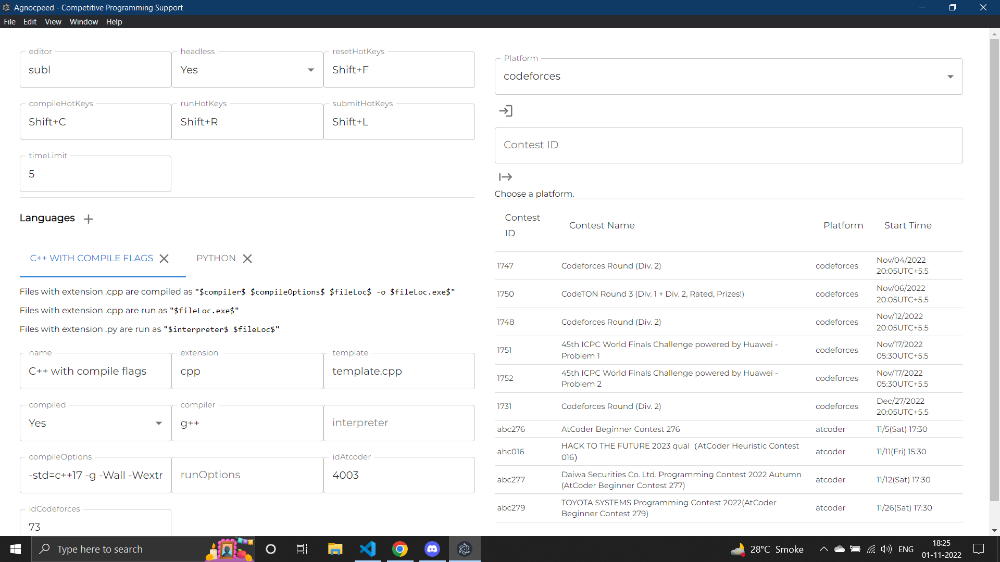
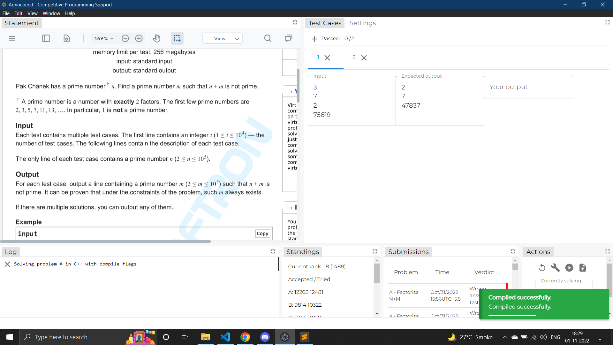

# AGNOCPEED

Agnocpeed is an OS agnostic desktop app created using Electron + React. User can configure it with their favourite editors, languages and templates. It is designed such that a competitive programmer can fully focus on problem solving and tries to reduce the barriers such as copying testcases, constantly opening standings page, worrying about the verdict of your latest submissions.

## Build steps

Git, NodeJS and NPM must be installed. Then type the following in a terminal to generate a build for your OS.

```
git clone https://github.com/anujdhillxn/agnocpeed.git
cd agnocpeed
npm ci
npm run electron:build
```

A Build will be generated in the dist folder. The dist folder will contain an installable as well as the installed app.

## Usage

- Run the executable generated by the build.
- Read the settings section below.
- Select a platform (Codeforces or Atcoder) or choose the practice mode.
- Logging in or not logging in is upto you and some features won't work accordingly.
- Enter a contest id. Future contest IDs are displayed in the table.




### Settings

- Change the editor to the one that you currently have.
- C++ language added by default. Set your template file path in the config. You can add other languages and configure them accordingly.
- Make sure your system can support the run and compile commands that are mentioned.

### Actions

- All actions have a hotkey combination which can be changed. Must be a valid list of hotkeys separated by '+'.

### Statement

- A screencast for viewing the problem statement. 

### Test Cases

- The verdict is judged by string comparison and treating all whitespaces as a single space, then trimming the string.
- All run commands will be executed upto 'Time Limit' seconds property in settings.

### Log

- stdout or stderr of every command run by agnocpeed is displayed in the log.

### Submissions

- resources/extraResources/win.mp3 will be played when a new successful submission with a positive verdict is detected.
- resources/extraResources/lose.mp3 will be played when a new successful submission with a negative verdict is detected.

## Following features will be added if the app gains popularity among the competitive programming community.

- Support for Codechef.
- Stress testing.
- Interactive mode.

## Known bugs

- Infinite loops don't terminate after timeout in windows and need to be done manually.
